# 写在前面

从这个博客初创到现在已经三天了，用codex从零开始，从把网站搭起来到现在网站上线了各种功能,我想是时候记录一下我是如何将这个博客做到现在的了。如果你是和我一样的互联网小白，不妨看看这篇文章，看看我是如何用codex将我的博客方便快捷地搭建起来的！

我也是在做一个阶段性的记录，我的博客现在的样式、内容和功能都还是特别的简陋原始，等到以后我的博客要是变成了特别华丽，再回来看现在这个状态，一定会很感慨的！！！

- ### 首先的首先，你需要一个codex来辅助，方法详见我的另一篇文章[《如何在你的电脑上简单且实惠地使用codex》](codex-application.html).

# 一、博客本地初建
最开始，我直接将我想要搭建博客的想法告诉了codex，让它给我介绍个人博客的常见模式和搭建流程。

codex的回复：
> ### 博客的基本逻辑：
>可以把个人博客想象成"开一家小店":
>内容(文章) 是店里的商品,是你写的东西;
>样式(页面) 是店面的装修,决定访客看到什么样子;
>托管和域名(店址) 是开店的位置,决定了别人通过什么网址能找到你。
>搭建博客的全部工作,就是回答这三个问题:你打算怎么写作和发布?你想要什么样的外观?你希望它挂在哪个网址上?
>三条主流路线,难度从低到高
>- 路线一:用现成平台,零代码(最快)
>在小红书、公众号、Notion、语雀这类平台上直接写。优点是完全不用碰代码,缺点是你受平台约束,页面基本不能自定义,内容也可能受平台规则影响。
>- 路线二:静态博客 + 免费托管(推荐给想动手的人)
>用现成模板生成一个"静态网站",再免费托管到 GitHub Pages 或 Vercel。优点是速度快、免费、完全属于你,也能深度自定义;缺点是需要学一点最基础的操作,比如改配置文件、用命令行上传。
>- 路线三:从零手写网站(最自由,也最费力)
>用 HTML/CSS/JavaScript 自己写页面,或用 React 这类工具搭建。适合本身想学编程、把博客当练习项目的人。如果你只是想写东西,这条路性价比不高。
>
>### 我推荐的入门路径:
>路线二。具体来说,常见的做法是选一个现成的博客框架(比如 Hugo、Hexo、Astro),套一个喜欢的主题模板,之后你只需要写文章,框架会自动把文章变成网页,再一键发布到免费托管平台。整个过程不需要你精通编程,但你能拥有一个完全属于自己的博客。
>一套典型流程是这样的:
>1. 在电脑上装好基础工具(通常就一两个);
>2. 用模板初始化一个博客项目(一次命令就能生成);
>3. 选一个主题,改好你的名字、简介、头像这些基本信息;
>4. 用 Markdown 写文章(一种很简单的纯文本格式,写起来就像记事本,但有标题、加粗、链接这些能力);
>5. 本地预览确认没问题;
>6. 推送到托管平台,获得一个免费网址(比如 你的名字.github.io);
>7. 以后想发新文章,重复第 4 步和最后一步就行。
>
>### 现在可以怎么开始
>在你动手前,有一个选择会直接影响体验:你想不想用命令行? 静态博客的搭建步骤大多需要敲几条命令,虽然不难,但如果你完全没接触过,我们也可以走更省事的路线——比如我帮你把整个博客在你这个文件夹里搭好,你只需要负责写文章和点几下发布。
>如果你愿意,我现在就可以帮你做其中一件事:
>帮你搭一个现成的静态博客项目(推荐,一小时左右能上线);
>先给你一份图文版详细教程,你照着一步步做;

最终我选择了路线二，且直接让它帮我写了一份本地的静态博客项目：

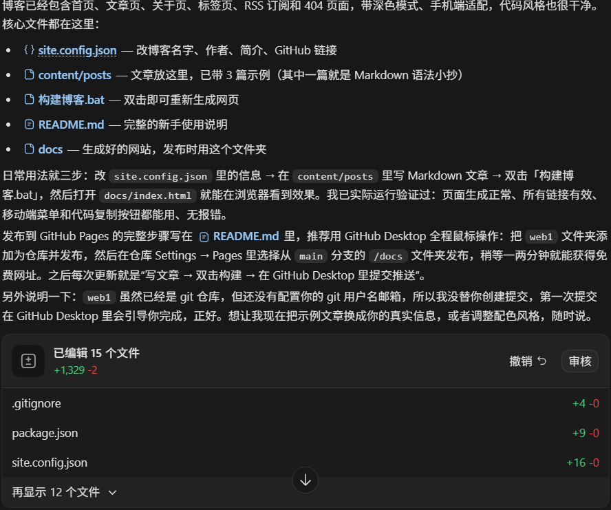

# 二、Github部署
1. 注册并登录[Github](https://github.com/)，创建你的github仓库用于存放你的博客项目的文件。
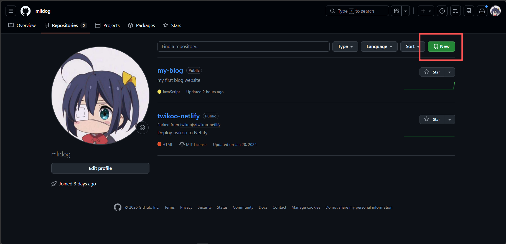 
写上你仓库的名字并将它调成公开，名字关系到你的博客的子域名，详细可以问codex`介绍Github Pages仓库规则`。
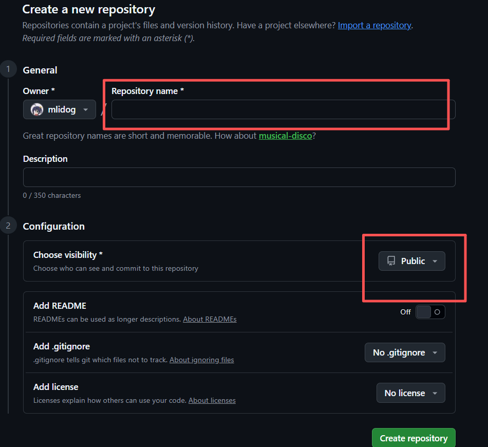
2. [下载Github Desktop](https://desktop.github.com/download/),在Github Desktop上登录你的Github账号。
3. 如果codex帮你写好了git配置，那你只需要在Github Desktop上面克隆你之前创建好的仓库（clone repository），选择你博客的文件夹，这样以后就能在Github Desktop上面管理你的博客提交了。
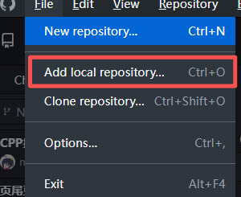
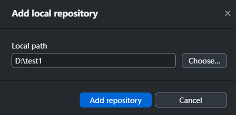
以后文件后变化都会在这里显示
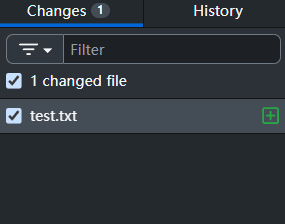
4. 如果codex没有写git配置（那你就叫它写一个），那你只需先将你创建的仓库克隆到本地，然后把codex给的文件放进去就可以了。
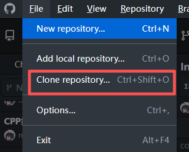
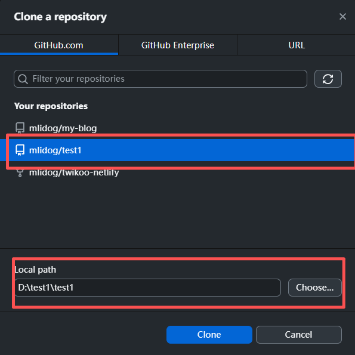
5. 提交你的博客文件到Github，这一步需要你填写提交的摘要（summary）。
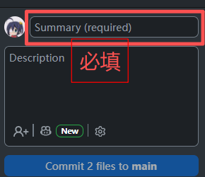
填完后点`commit xxx to main`
6. 将提交的文件推送到Github。
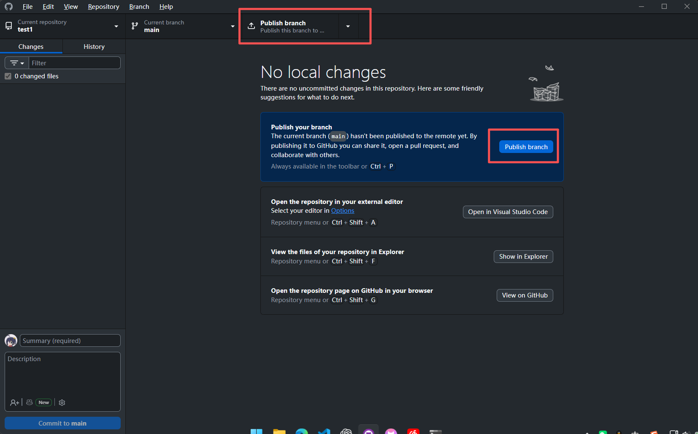
<small>（这两个随便点一个）</small>

7. 这时候回到Github，你会看见你提交的文件已经出现在仓库里面了。
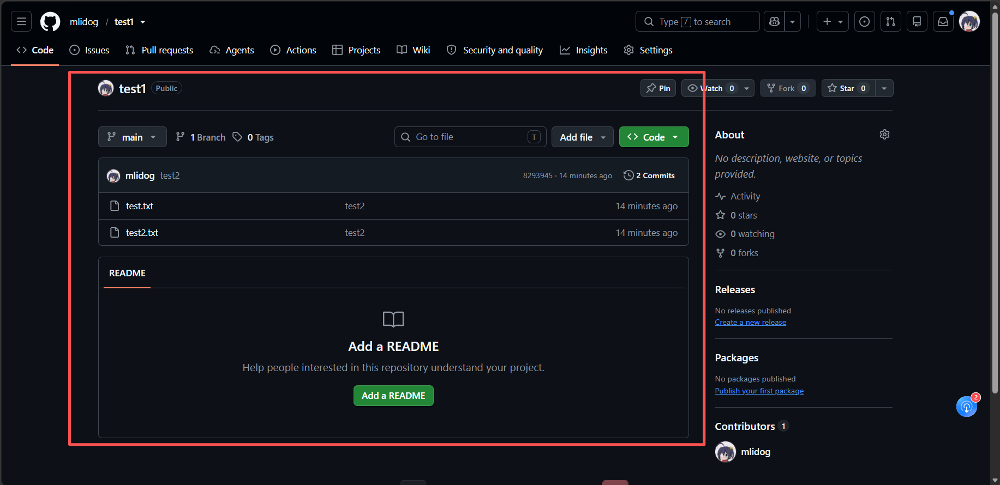
8. 现在去`setting-Pages`里面配置网页托管，`source`里选择`Deploy from a branch`,下面的`branch`里面选择`main`、文件夹选择`/docs`。（仅选择/docs里面的文件作为网站的部署内容）
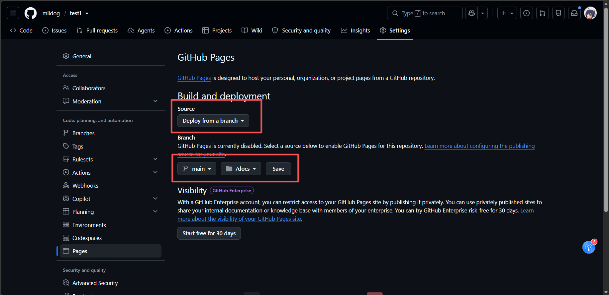
如果一切顺利，等1-2分钟就可以在`https://用户名.github.io/仓库名/`这个域名看到你的博客网站了。
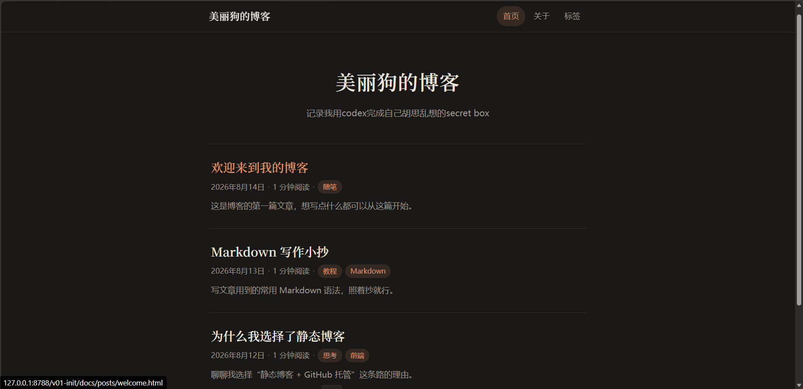
<small>这个是我的博客最初的样子</small>

### 至此，你已经拥有了一个自己博客网站了！
### Congratulations！
---
### 接下来就是优化网站的样式、功能和内容了，下面的优化内容仅作参考，你可能有比我更好的优化思路。

# 样式
- 增加侧边栏，把导航和简介放到侧边栏
- 增加头像，提高辨识度

# 功能
- 添加深色模式
- 添加回到顶部、返回按钮
- 添加阅读量、点赞、评论功能（这一步很麻烦、想要做到全网统计需要用到各种服务，详细可以问你的codex）
- 添加归档和搜索功能

# 内容
- 各种记录和文章，纯看你个人了

---

# 写文章时有用的技巧
因为我是在vscode里面用md文件以markdown语法写文章的，每次写完都要打包形成html文件更新网站才能看到预览，操作非常的繁琐。现在我让codex写了个监听脚本，监听到我的md文件或者css文件变化了就自动运行打包脚本，再配上vscode的live server拓展，就可以做到实时预览网页了，非常好用。
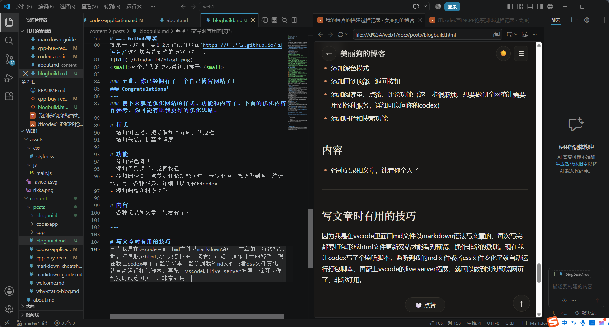

---
# 最后
博客搭建过程还有挺多坑和经历没有写出来的，因为有点乱而且我前期也确实没做记录，我会在这里贴上我的网站的[README](./blogbuild/README.md)文件（codex写的），它里面记录了一些搭建过程、一些教程和一些常见的疑问，有兴趣可以看看，当然如果你想了解更多或者有问题不妨直接[联系我](../about.html)。
- [README浏览](./blogbuild/README.md)
- <a href="./blogbuild/README.md" download>README下载</a>