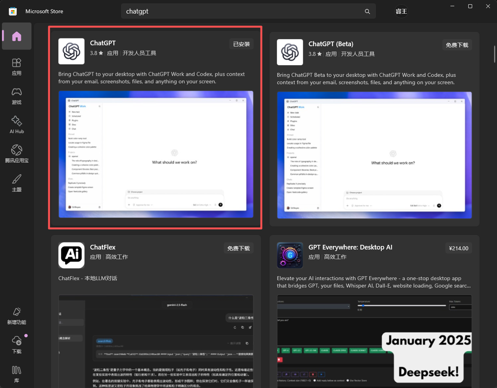
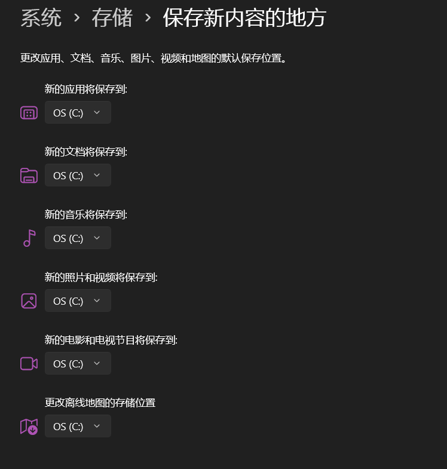
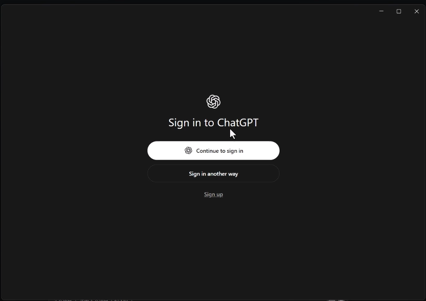
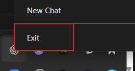
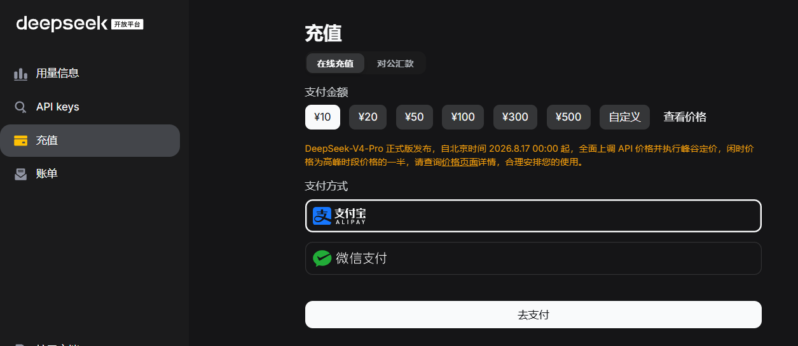
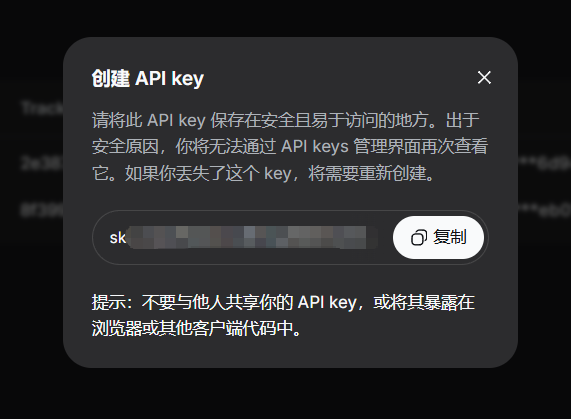
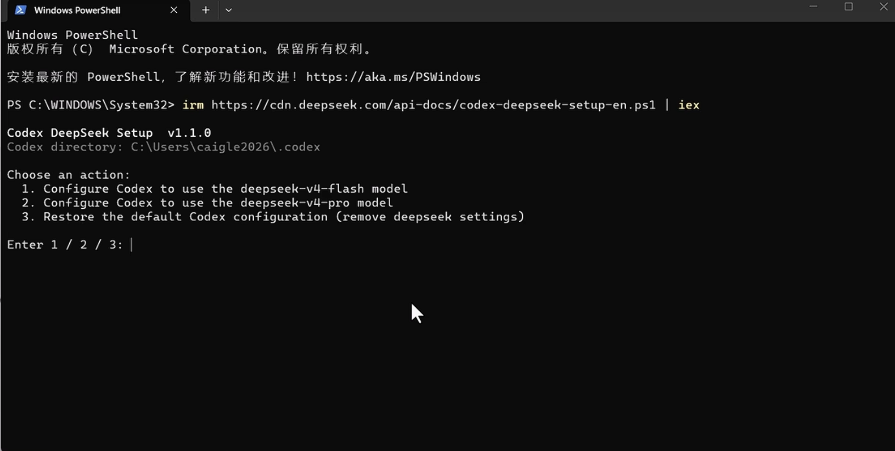
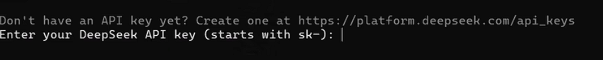
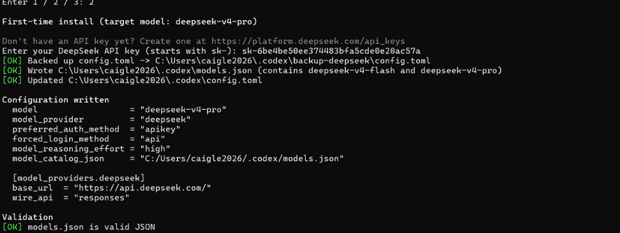
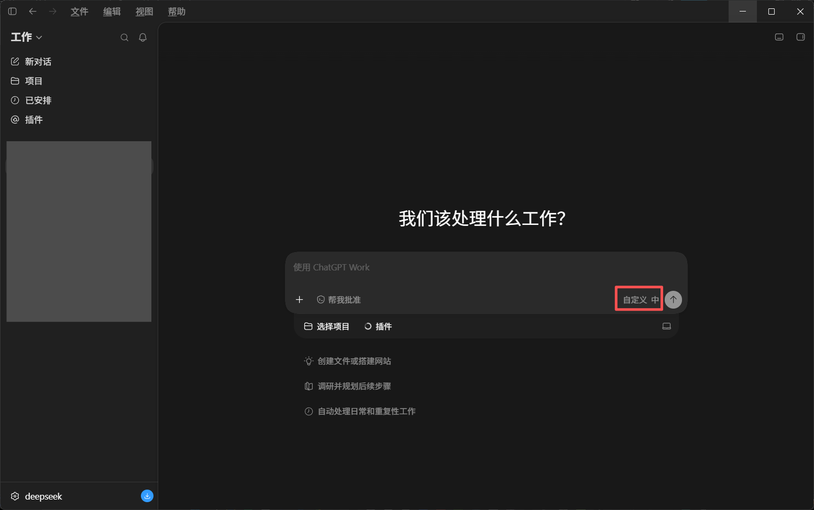

# 写在前面：
这篇文章编纂于2026年8月15日，正碰上[deepseekv4模型涨价](https://api-docs.deepseek.com/zh-cn/quick_start/pricing/)，我没有比对目前市面上的各种模型的性价比，只在我个人的认识内认为deepseek要实惠一点,如果你有更好更具性价比的选择可以[联系我](../about.html)（我也想要便宜的ww~），指导我更正这篇文章，万分感谢！    

这篇文章只涵盖如何将deepseekv4-flash模型接入codex，并不涉猎对于原生codex的教程，例如：注册chatgpt账号、购买会员、调用OpenAI的各类模型等等。（因为太麻烦了我也不会......）

---
# 一、配置工作环境
1. [安装git](https://git-scm.com) &nbsp; https://git-scm.com
2. [安装nodejs](https://www.nodejs.org) &nbsp;https://www.nodejs.org
3. [安装vscode](https://code.visualstudio.com) &nbsp;https://code.visualstudio.com

都是傻瓜式安装，在官网下好安装包后直接安装，然后点击next→next→next→...→finish就ok了。
<small>（如果下载慢就挂梯子）</small>
   
# 二、下载codex
由于2026/7/9 Codex桌面应用并入了ChatGPT桌面端，所以我们实际上下载的是ChatGPT桌面端。  

直接在微软商店上搜索ChatGPT即可：

<small>（如果下载慢就挂梯子）</small>
如果你没有修改过电脑保存的地址的话，那微软大概率是会自动给你下载到C盘的，你只需要在下载前在电脑系统设置中修改就可以了。


### 下载完成后一定要先打开一次！即见到以下这个窗口：

然后退出整个chatgpt程序。（最好在任务管理器中确保chatgpt退出了）


# 三、注册deepseekAPI
1. 前往[deepseek开放平台](https://platform.deepseek.com/),注册/登录deepseek账号。
2. 在开放平台充值，只用充个10块钱随便玩玩就可以，[详细定价](https://api-docs.deepseek.com/zh-cn/quick_start/pricing/)也可在deepseek开放平台查询。

1. 在开放平台申请一个API：

1. **妥善保管你的API key！妥善保管你的API key！！妥善保管你的API key！！！**

# 四、接入deepseekv4-flash的API接口
1. 阅读deepseek官方的[接入教程](https://api-docs.deepseek.com/zh-cn/quick_start/agent_integrations/codex)，现在我们使用官方教程的方法一（一键配置脚本）给codex接入deepseekv4-flash模型。
2. **打开你的powershell窗口，输入官网上的一键配置脚本：**

```
irm https://cdn.deepseek.com/api-docs/codex-deepseek-setup-en.ps1 | iex
```

   powershell会输出以下窗口：

<small>（1为配置deepseekv4-flash模型，2为配置deepseekv4-pro模型，3为重置codex配置）</small>

**我们选择1，配置deepseekv4-flash模型。** 

随后会弹出需要我们输入API的窗口：


**我们输入刚刚在deepseek获取的API就可以了**


<small>（图片里面是v4-pro模型，配置完成后我们显示是`deepseek-v4-flash`就可以了）</small>
  
**随后我们就可以重新进入codex**
初始界面应该是这样的：

模型里面显示自定义是正常的，左下角显示的你使用的是deepseek就可以。  

如果你进入codex时是英文，只需要挂着梯子在codex里面把语言调成简中/繁中，然后重启一遍codex就可以了。

&nbsp;
### 至此，你就可以开始在电脑上愉快地使用codex了！
### Congratulations！
&nbsp;
codex真的挺好玩的，希望本文能给您带来些许帮助——这便是它最大的价值。感兴趣或者有问题可以进一步[联系我](../about.html)！