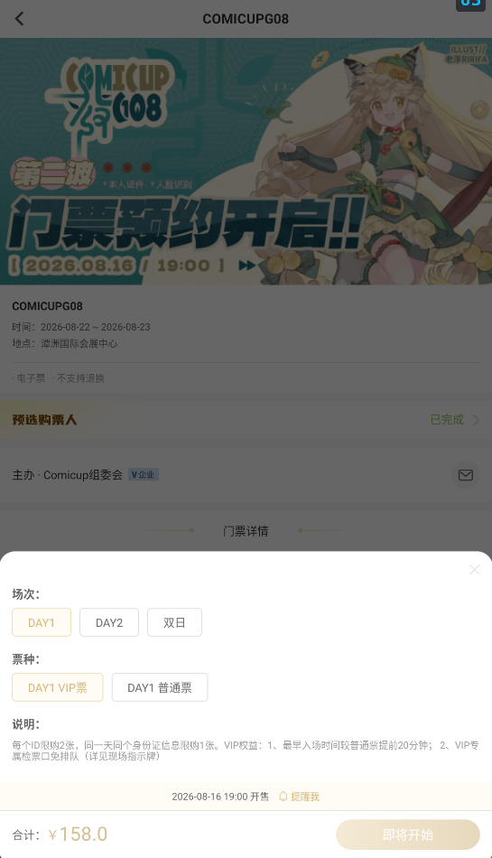

这篇文章的起因是我在经历了数次CPP抢票失败（或者是极限抢到VIP票）后，痛定思痛想要动用科技的力量来造福大家（误
这篇文章详细记录了我是如何用codex写一个抢票脚本的过程。

---

# 一、抢票脚本的运行逻辑
在我第一轮问了codex抢票脚本的运行逻辑后得到了以下回答：

>## 脚本的运行逻辑
>
>抢票脚本的本质，是用程序代替人手完成「登录 → 盯场次 → 开售瞬间提交订单」，核心优势就是速度和稳定性——人点一下要几百毫秒，程序可以提前准备好、在开售的瞬间发起请求。
>通常有两种实现方式：
>直连接口（Python + requests）：直接调用 CPP 网页或 App 的购票接口，速度最快、最接近"瞬间抢到"。代价是需要先分析出下单接口长什么样。
>模拟浏览器（Playwright）：让程序像真人一样操作页面，兼容性好、不容易触发风控，但速度略慢、资源占用高。很多成熟方案是两者结合：平时走接口，遇到验证码时切到浏览器。
>一个完整的抢票流程大致是这样：
>登录并保持会话——用你的账号登录，拿到 cookie/token。平台如果有滑块验证，这一步常常还是需要你手动帮一次。
>校准时间——程序先向服务器要一次时间，算出本机和服务器的时间差，避免"本机 12:00:00 开抢，服务器其实还差 0.3 秒"这种致命误差。
>预加载目标——开售前把活动、场次、票种、数量全部查好，锁定要买的目标，下单参数提前准备。
>等待开售瞬间——在目标时间前几百毫秒开始高频提交请求。
>提交订单并处理结果——循环提交，识别「未开售」「已抢光」「排队中」「下单成功」等返回；一旦成功立刻停手，防止重复下单。
>交给人工收尾——支付、二次验证、实名认证这些环节通常还是真人完成。
>几个关键细节：要在浏览器开发者工具（F12 → 网络）里找到下单请求，把参数复制出来，脚本就是"重复这个过程"；请求头、cookie 要模仿真实浏览器；加一点随机延迟，频率别太离谱，否则会被平台风控盯上；每步写日志，方便排查。

因为模拟浏览器操作页面这个方法还是太慢了（抢不过其他脚本），所以我选择使用直连购票接口，且我选择在PC端使用带宽能力更强的网线连接互联网，以求达到最快的抢票速度（快一点啊再快一点啊！）
  
# 二、初步操作方法
在我向codex说明了我的操作环境（PC端用模拟器抢票）后，codex给出如下操作方法：

>第一步：装模拟器和 CPP App
>下载 雷电模拟器 或 MuMu 模拟器（都免费，Windows 上很成熟）。
>安装时选 Android 7 以上的系统版本，并关闭 root 权限（两个模拟器设置里都有开关）——票务类 App 对 root 和模拟器有检测，关掉能降低被风控的概率。
>装好后，在模拟器自带的应用商店搜 CPP，或者去官网下载 APK 直接拖进模拟器窗口安装。
>第二步：配置 Fiddler 抓包
>下载安装 Fiddler Classic（免费版就够用）。
>打开 Fiddler → Tools → Options → HTTPS，勾选 Decrypt HTTPS traffic，让它能解密 HTTPS 流量。
>查看你电脑的局域网 IP：打开命令提示符输入 ipconfig，记下无线网卡（WLAN）那一行的 IPv4 地址。
>在模拟器里进入「设置 → WLAN」，长按已连接的 Wi-Fi 网络 → 修改网络 → 代理改为「手动」，主机名填刚才的 PC IP，端口填 8888（Fiddler 默认端口）。
>在模拟器的浏览器里访问 http://<你的IP>:8888，下载 FiddlerRoot certificate 证书文件，然后到模拟器「设置 → 安全 → 安装证书」里把它装为 CA 证书。这一步只做一次。
>第三步：走流程，抓出下单接口
>打开模拟器里的 CPP App，正常登录（需要手动过验证码就手动过）。
>手动走到选好票种、准备下单的页面。
>回到 Fiddler，用筛选框只保留 CPP 相关的域名，找到「创建订单 / 下单」这个 POST 请求。
>右键该请求 → Copy as cURL，把内容发给我。
>到这里，后面就交给我了：我会根据这个请求写一个 Python 脚本，复用你的登录凭证，加上对时、开售瞬间提交、处理排队/售罄的逻辑，在你电脑上直接跑。模拟器和 PC 共用系统时间，时间校准也简单

（PS:上面的流程只有添加购票人、手动选票种、进入准备下单的页面需要你来操作，其他所有流程都可以让codex自动完成。  至于怎么在电脑上使用codex，可以看我的另一篇文章[《如何在你的电脑上简单且实惠地使用codex》](https://example.com)）

### 注意事项：
1. 在模拟器中设置手动代理时会出现“设置不了ip地址/根本没有设置界面”等等情况，这是因为模拟器上面用的是虚拟网络，一些模拟器隐藏了手动代理的入口，所以用ADB命令设置是最方便的：  
   
<small>（以下命令均用powershell运行）</small>
首先让ADB连接mumu模拟器：
```
\MuMuPlayer\nx_device\12.0\shell\adb.exe connect 127.0.0.1:16384
```
<small>（注意你的mumu模拟器的位置和版本号，有可能跟我这一行命令不一致）</small>  

然后设置fiddler代理：
```
adb shell settings put global http_proxy 192.168.x.x:8888
```
<small>（上面的192.168.x.x填你自己的ipv4地址）</small>
最后确认生效：
```
adb shell settings get global http_proxy
```
显示`192.168.x.x:8888`说明代理成功了，模拟器的流量都会经过fiddler，实现端口抓包。  
  
   
   鉴于以上流程还是太吃操作了，所以我还是强力推荐你使用codex一键完成：只要跟它说`“我需要你帮我完成模拟器的fiddler手动代理并检查是否成功”`就OK了。

2. 抓包CPP的购票端口这一步我是让codex完全自己做的（毕竟本人是计算机网络小白，根本看不懂fiddler里面大段大段的请求都是什么......），你只需要让做好购票前的准备，进入确认订单前的那个界面，然后让它自己读取fiddler里面的端口就可以了。


3. 由于我们第一次抓包的token和cookie会过期，所以开售日当天要启动fiddler再抓一遍包，更新token和cookie，检查登录凭证等等。当然你只需要在开售日当天让codex再帮你走一遍抓包流程就可以了。

# 三、验证脚本运行
我验证脚本运行就是直接让codex运行脚本帮我下了一张别的票的单，验证它可以创建并确认订单，我只要去付钱就可以了。


# 四、实际操作（开售日当天）


# 五、附件
最后我会把这个脚本文件和使用说明放到这里，你想要使用的话可以直接丢给codex，你只需要用fiddler抓包到你自己的信息就可以适配了。（当然也是给codex做）